# 💎 WiseWallet
###Smart Analytics. Better Finances.

WiseWallet is an interactive data analytics dashboard built using **Python**, **Pandas**, **Streamlit**, and **Google Gemini AI**. It transforms raw bank transaction data into meaningful financial insights through data cleaning, KPI analysis, interactive visualizations, and AI-generated analytical summaries.

The project demonstrates an end-to-end data analytics workflow—from data preprocessing to dashboard development and AI-assisted insight generation.

---

## 📸 Screenshots

### Landing Page
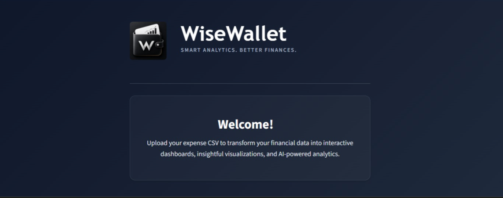

### Landing Page
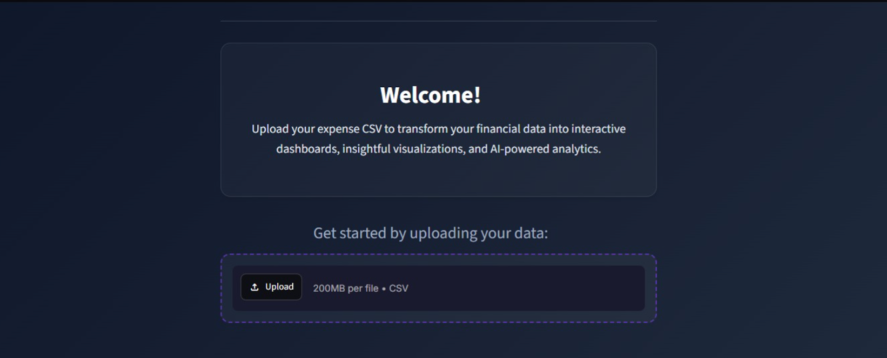

### Sidebar
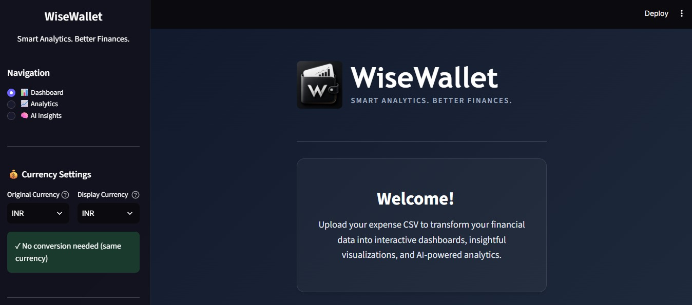

### Dashboard Overview
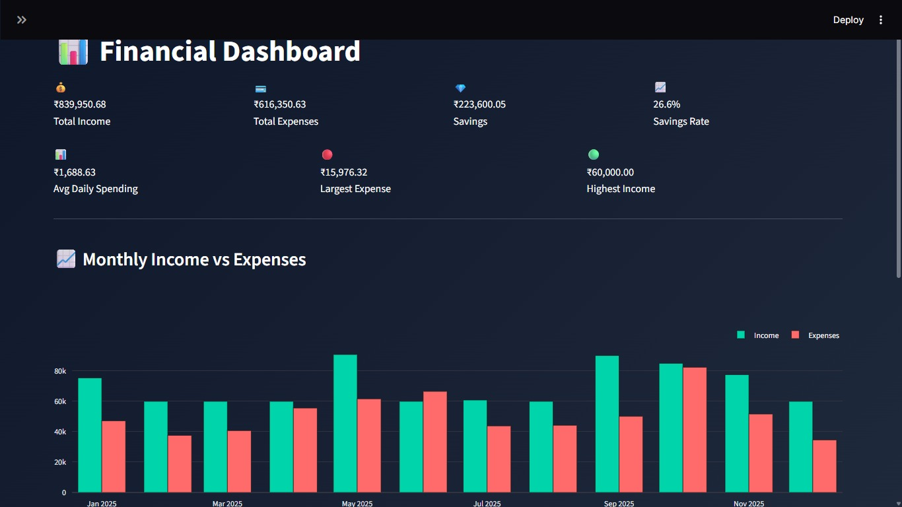

### Dashboard Overview
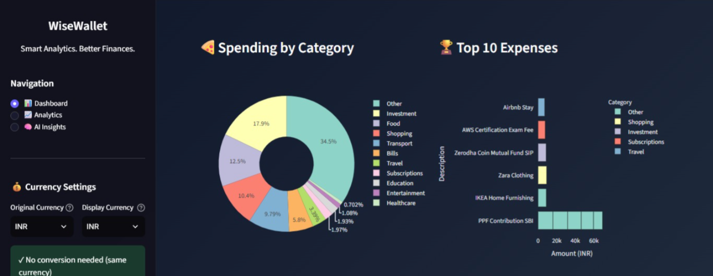

### Analytics Dashboard
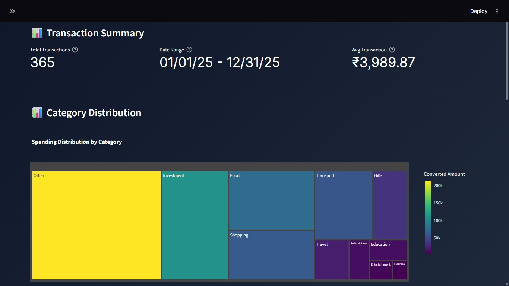

### Monthly Analysis
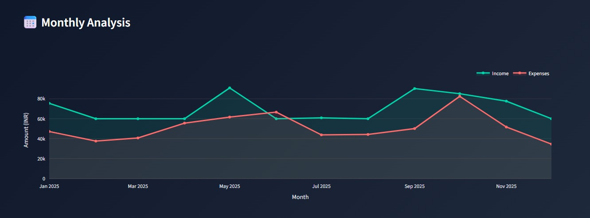

### AI Insights
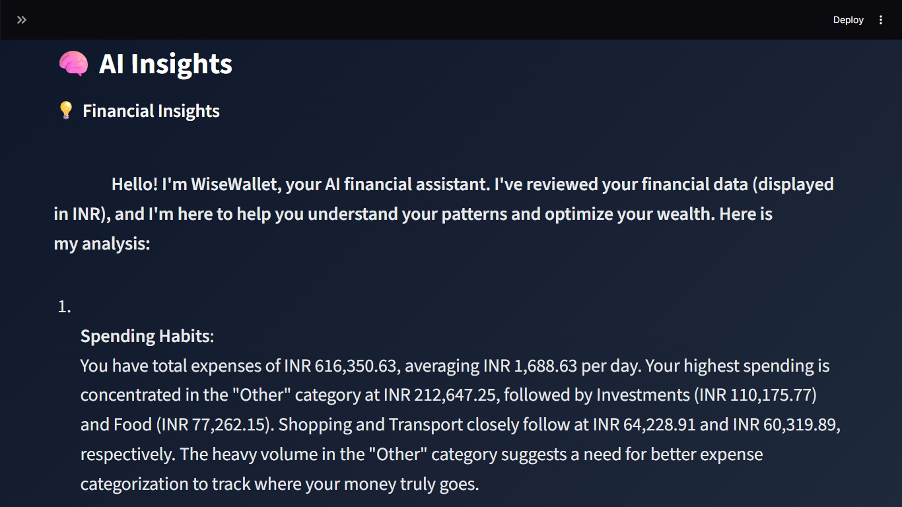

### AI Insights
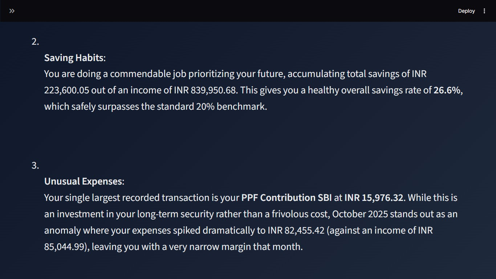

### AI Question & Answer
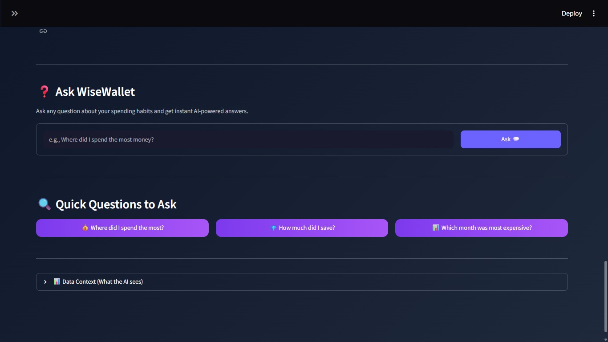

### Filters 
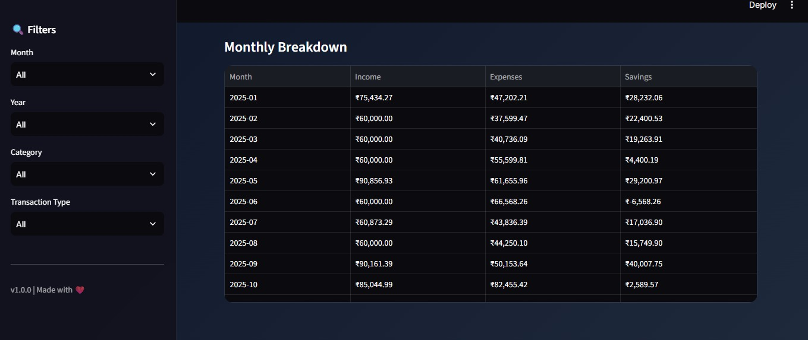

### Currency Settings
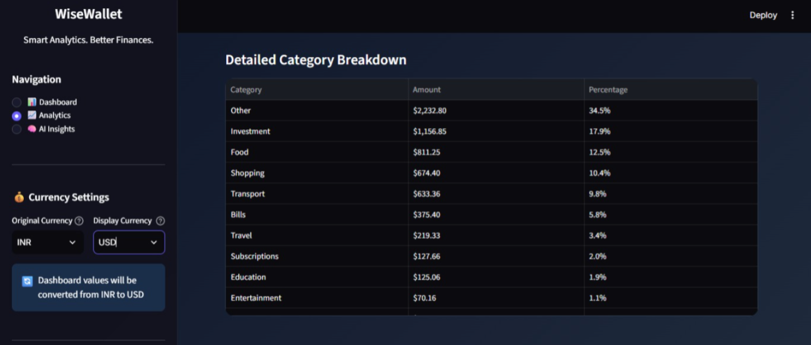


---

# ✨ Features

### 📊 Data Processing
- Upload transaction CSV files
- Automatic data cleaning
- Missing value handling
- Transaction formatting
- Category detection

### 📈 Financial Analytics
- Total Income
- Total Expenses
- Net Savings
- Savings Rate
- Average Daily Spending
- Largest Income
- Largest Expense

### 📉 Interactive Visualizations
- Monthly Income vs Expenses
- Category-wise Spending
- Spending Distribution
- Monthly Trend Analysis
- KPI Cards
- Interactive Filters

### 🤖 AI Analytics (Google Gemini)
- Automatic financial summaries
- Spending pattern analysis
- Budget recommendations
- Savings observations
- AI-powered financial Q&A

### 💱 Currency Support
- Multiple currency selection
- Live exchange rate conversion
- Original vs Display currency comparison

---

# 🛠 Tech Stack

| Category | Technologies |
|----------|--------------|
| Language | Python |
| Framework | Streamlit |
| Data Analysis | Pandas |
| Visualization | Plotly |
| AI | Google Gemini API |
| Environment | python-dotenv |
| Version Control | Git & GitHub |

---

# 📂 Project Structure

```text
WiseWallet-AI/
│
├── app.py
├── requirements.txt
├── README.md
├── .env.example
│
├── ai/
│   ├── claude_client.py
│   └── prompts.py
│
├── components/
│   ├── analytics.py
│   ├── dashboard.py
│   ├── insights.py
│   └── sidebar.py
│
├── config/
│   └── settings.py
│
├── services/
│   ├── finance_analytics.py
│   └── transaction_analyzer.py
│
├── utils/
│   ├── currency_service.py
│   └── data_processor.py
│
├── assets/
│   └── logo.png
│
├── screenshots/
│   ├── landing_page.png
│   ├── dashboard.png
│   ├── analytics.png
│   ├── ai_insights.png
│   ├── qa_assistant.png
│   └── filters.png
│
└── sample_data/
    └── sample_transactions.csv
```

---

# 📊 Data Analytics Workflow

```
CSV Dataset
      │
      ▼
Data Cleaning
      │
      ▼
Data Processing
      │
      ▼
Financial KPIs
      │
      ▼
Interactive Dashboard
      │
      ▼
AI Insight Generation
```

---

# 📈 Key Performance Indicators

- Total Income
- Total Expenses
- Net Savings
- Savings Rate
- Average Daily Spending
- Largest Expense
- Largest Income
- Category-wise Spending
- Monthly Trends

---

# 🤖 AI Analytics

WiseWallet integrates **Google Gemini** to provide intelligent analysis of financial datasets.

The AI module can:

- Analyze spending behavior
- Detect unusual spending patterns
- Generate concise financial summaries
- Answer user questions about uploaded transaction data
- Provide actionable budgeting recommendations

---

# 🚀 Installation

Clone the repository

```bash
git clone https://github.com/yourusername/WiseWallet-AI.git
```

Navigate into the project

```bash
cd WiseWallet
```

Install dependencies

```bash
pip install -r requirements.txt
```

Create a `.env` file

```env
GEMINI_API_KEY=YOUR_API_KEY
```

Run the application

```bash
streamlit run app.py
```

---

# 📁 Dataset Format

The application expects transaction data in CSV format.

Example columns:

- Date
- Description
- Category
- Amount
- Type (Credit/Debit)

---

# 🎯 Skills Demonstrated

- Data Cleaning
- Data Wrangling
- Exploratory Data Analysis (EDA)
- KPI Development
- Dashboard Design
- Interactive Data Visualization
- Python Programming
- Pandas
- Streamlit
- AI Integration
- API Integration
- Financial Data Analysis

---

# 🔮 Future Enhancements

- PDF Statement Support
- Export Dashboard as PDF
- Budget Tracking Module
- Forecasting & Trend Prediction
- Expense Anomaly Detection
- User Authentication
- Database Integration
- Advanced AI Analytics

---

# 👩‍💻 Author

**Moupriya Ghosal**

Aspiring Data Analyst passionate about transforming raw data into actionable insights using Python, SQL, Power BI, and AI-powered analytics.

GitHub: https://github.com/moupriyaghosal

LinkedIn: 
https://www.linkedin.com/in/moupriya-ghosal-357b6a367/

---

## ⭐ If you found this project helpful, consider giving it a star!